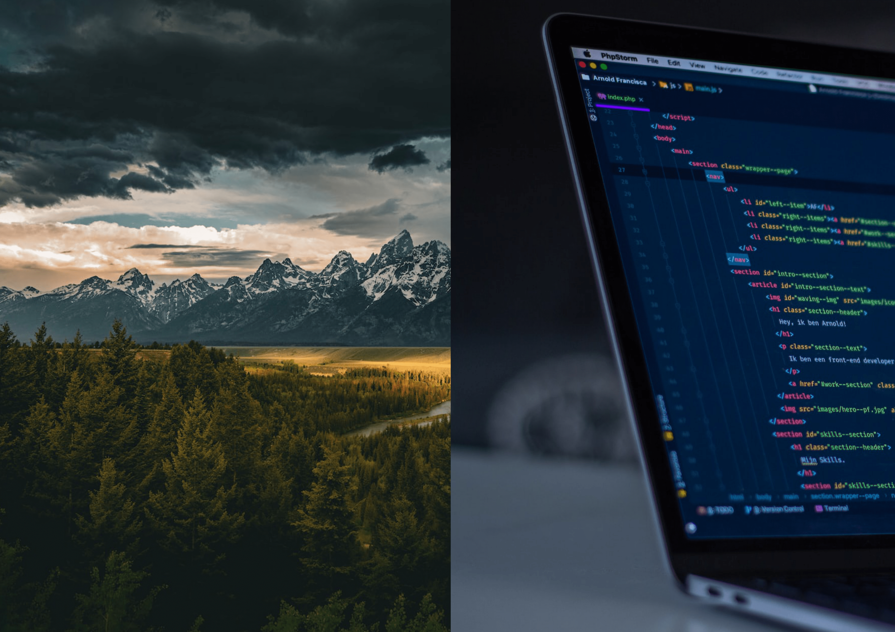

This is the story of my journey, from the environmental field to the tech industry, a career change almost 5 years in the making.

Towards the middle of 2016, while working as a seasonal research associate, I knew something wasn't quite right. I enjoyed the subject matter of what I was working on, but the career potential was like trying to grow a tree in the narrow crack of concrete, and the novelty of moving to a new city for every new seasonal job began to wear off. I began the search for something else, reading broadly and experimenting. Two of the most notable paths that I set my sights on were tech and healthcare. I chose to experiment with tech first and at the end of 2016, I explored the realm of data science since it seemed like a natural pivot with my background in science. I began to exploring data science with R and continued with SQL into that summer.

At the end of the summer of 2017, I worked as a seasonal field-based Research Associate Lead in eastern Oregon. But two events changed everything that summer. The first event started out innocuous. While in the remote wilderness of Oregon, my team and I stumbled across locals at our campsite. They quickly grew hostile, took out their guns for target practice, and made clear, but subtle hints as to their intentions if we didn't leave. We left immediately and once we made it back to town, called the sheriff. They got away. The second event quickly followed the first. Once I had my time off, I had to escape the environment of eastern Oregon, choosing to go to Portland Oregon. During my time-off, I got involved in a biking accident, and I injured my left knee and went to the E.R. I was in intense pain and on crutches for weeks with only myself to rely on. Despite the pain, I tied loose ends for my employer and ensured that there was proper handoff for the next lead. After a few weeks, I drove back home to southern California. That's when my anxiety over my new direction really set in. I couldn't bring myself to go back to the environmental field, but I didn't know where else to go.
  

I came out of that dark time, and towards the end of 2017, I went back to my original strategy of testing out tech versus healthcare. I had sampled tech, and next to sample was healthcare. Given my background and the market conditions, I went down the path of Physician Assistant. I experimented during this time by getting training and certifications to become an Emergency Medical Technician (EMT), which is a common stepping stone to enrolling in a University for Physician Assistant training. After obtaining my EMT certification and going out on a few calls, I felt that I was fully immersed in the healthcare indsutry. While looking for an EMT company to join, I received a call for an opportunity in the environmental field with a healthcare agency in the Bay Area. This sounded like a perfect fit.

As a full-time Environmental Scientist in the Bay Area, I was able achieve the growth I craved early in my career: effectively communicating with a diverse audience, analyzing data, learning new material constantly, and solving problems. However, during this time, something important was still missing from my day-to-day work-life... building. Therefore, at the end of 2019, I embarked on my self-taught journey. For two years, I burned the candle on both ends learning software engineering, building projects, and interviewing with recruiters. It was hard work and many times around 1:00 a.m., my doubts about a successful career switch would start to creep in. "Is everything for naught?", "Am I just wasting my time?". And it took a lot of grit too. One interview after another, rejection after rejection, self-evaulation after self-evaluation. I had to remain stoically enthusiastic (oxymoron) during the interview, practice the winner's mindset after the rejection, and adpot the growth mindset that the rejection was an opportunity for evaluation on what to do better the next time around. This part of the journey alone changed me in so many ways. But I was happy to put in the work because I finally found a promising career path where I could still enjoy the work itself.

On December of 2021, I joined PowerSchool as a remote full-time Full-Stack Software Engineer based in San Francisco.
